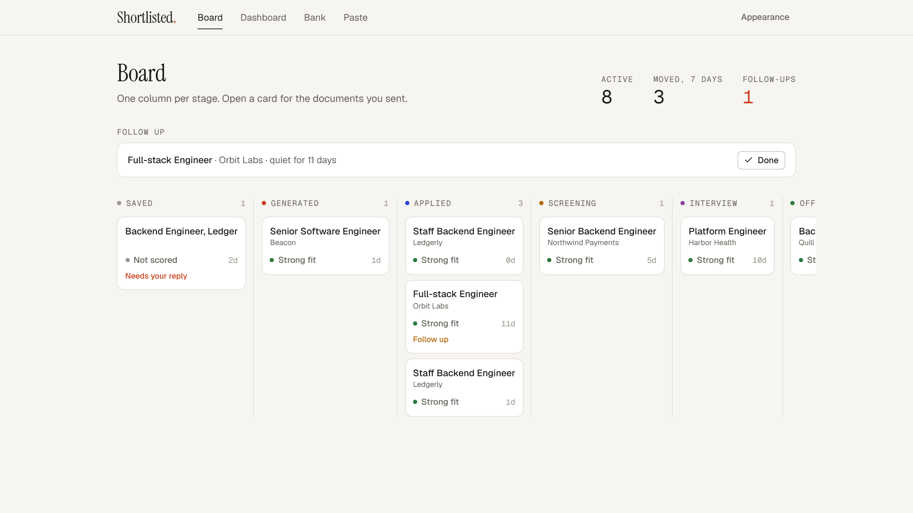
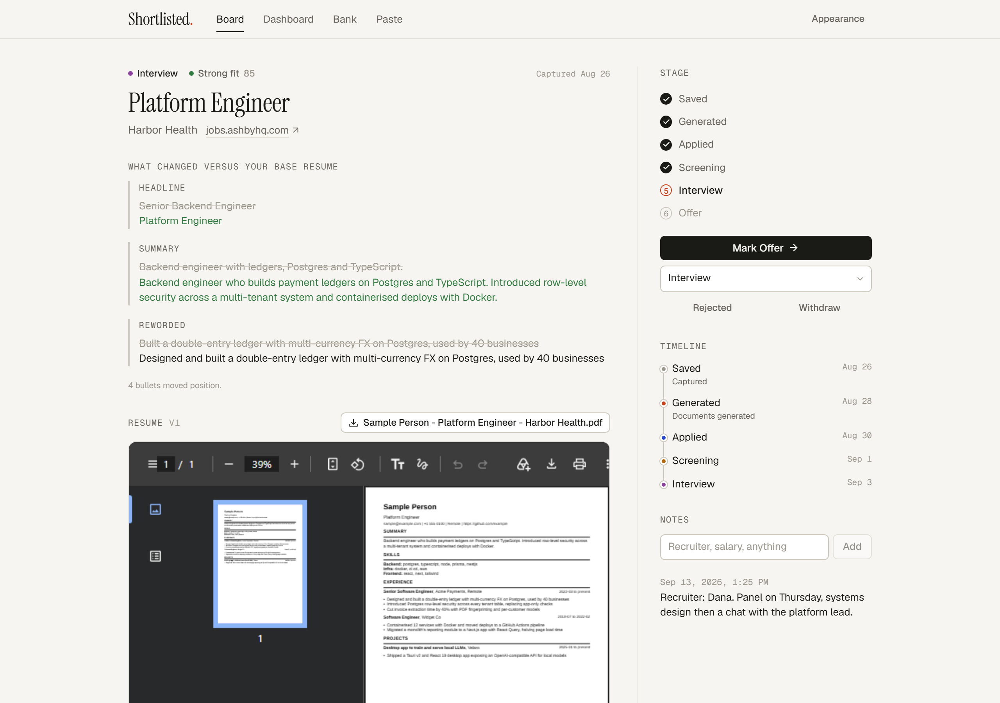
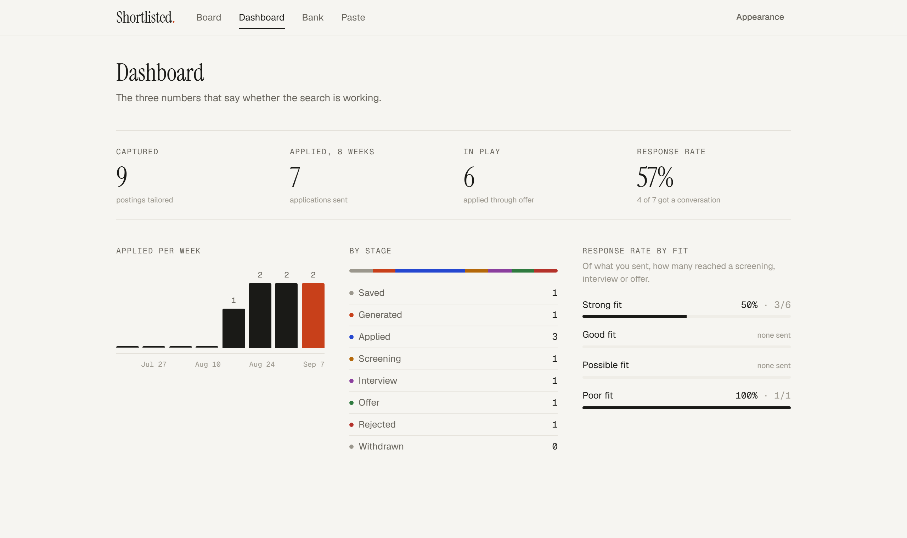
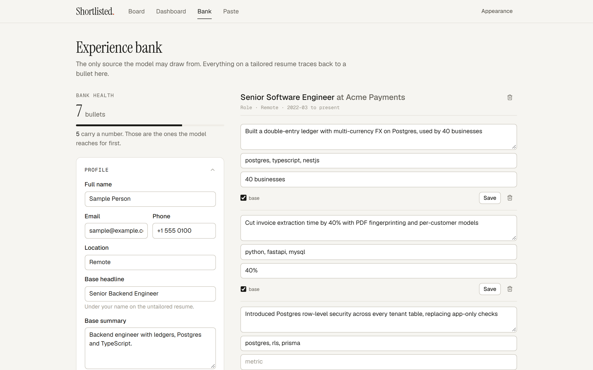
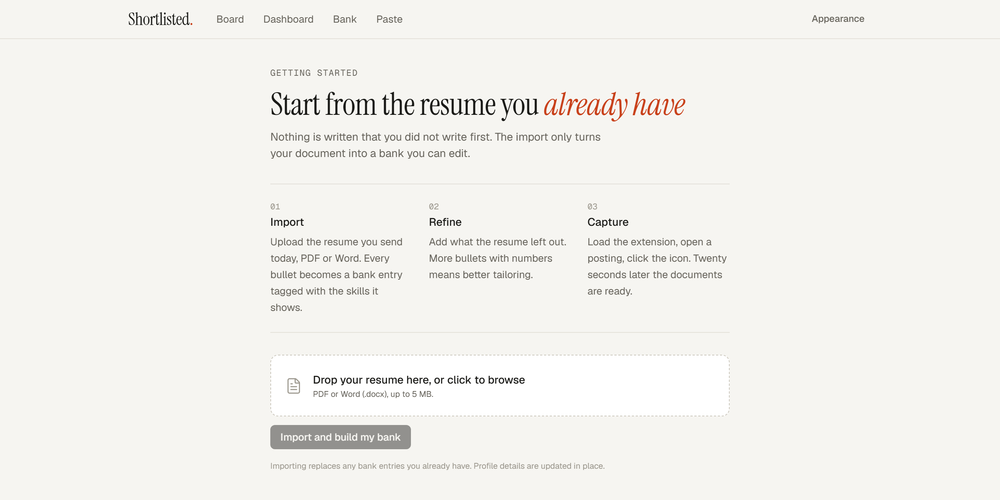
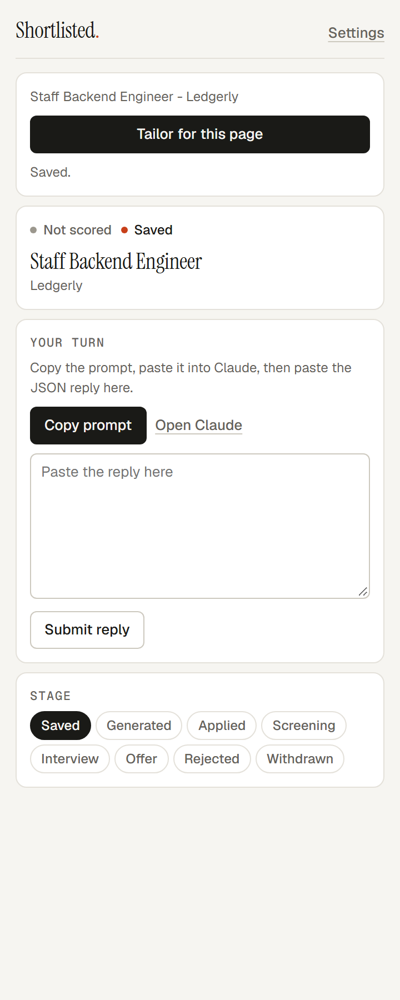
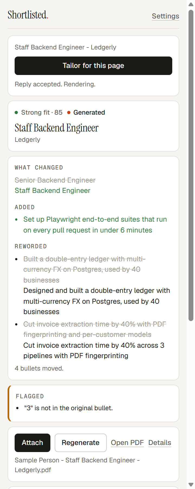

<p align="center">
  <picture>
    <source media="(prefers-color-scheme: dark)" srcset="docs/screenshots/logo-dark.png">
    
  </picture>
</p>

<p align="center">
  One click on a job page. A resume and cover letter tailored from achievements you actually wrote,<br>
  and every application tracked from Saved to Offer. Runs on your own machine.
</p>

<p align="center">
  
  
  
  
  
  
</p>

<p align="center">
  
</p>

## What it is

Applying for jobs is a loop of copying a posting, pasting it somewhere, proofreading output you do not trust, downloading a file and uploading it again. Shortlisted collapses that loop to one click.

- **Experience bank.** You write your achievements once, as bullets with skill tags and numbers. Import your current resume to get a first draft.
- **One click on a posting.** The Chrome extension reads the page. Twenty seconds later the side panel shows a fit verdict, a tailored resume, a cover letter, and exactly what changed versus your base resume.
- **The model selects, it never invents.** It picks bullets from your bank and may reword them lightly. Code validates every claim: any bullet not in the bank is dropped, any number or tool name that was not in the original is flagged. You review a short diff, not a whole document.
- **Attach.** One more click puts the PDF in the application form's file input and the cover letter in its textarea.
- **Pipeline tracker.** Saved, Generated, Applied, Screening, Interview, Offer. Every change is a timestamped event. A ten-day silence after Applied becomes a follow-up. A dashboard tells you whether the search is working.
- **Yours.** Postgres, the worker and the web app run in Docker Compose on your machine, bound to localhost. No accounts. The only thing that leaves your computer is the text you choose to send to a model.

## Screenshots

<table>
  <tr>
    <td width="50%"></td>
    <td width="50%"></td>
  </tr>
  <tr>
    <td align="center">Application detail. What changed, the rendered PDF, stage, timeline, notes.</td>
    <td align="center">Dashboard. Applied per week, where everything is, response rate by fit verdict.</td>
  </tr>
  <tr>
    <td width="50%"></td>
    <td width="50%"></td>
  </tr>
  <tr>
    <td align="center">The experience bank. The only source the model may draw from.</td>
    <td align="center">Onboarding. Drop your current resume, PDF or Word, and it becomes the bank.</td>
  </tr>
</table>

<p align="center">
  
  &nbsp;&nbsp;&nbsp;
  
</p>
<p align="center">The Chrome side panel. Left: right after a capture in manual mode. Right: the result, with one flagged rewording.</p>

Light and dark, three accent colours, chosen from Appearance in the header.

## Quick start

You need [Docker Desktop](https://www.docker.com/products/docker-desktop/), [Node 22+](https://nodejs.org/) with pnpm (only to build the extension), and Chrome.

```bash
git clone https://github.com/Maazaowski/Shortlisted.git
cd Shortlisted
cp .env.example .env            # nothing to edit for a first run
docker compose up -d --build    # Postgres, migrations, web app, worker. The first build takes a few minutes.
```

Open **http://localhost:3000**.

1. **Import your resume.** Drop the PDF or Word document you send today. Every bullet becomes an entry in your bank.
2. **Refine the bank.** Add what the resume left out. Bullets with numbers are the ones the model reaches for first.
3. **Load the extension.**
   ```bash
   pnpm install
   pnpm ext:build
   ```
   Go to `chrome://extensions`, turn on Developer mode, click Load unpacked, choose `apps/extension/dist`.
4. **Open a job posting and click the Shortlisted icon.**

That is the whole setup. If port 3000 is taken, set `WEB_PORT` in `.env`, run `docker compose up -d` again, and put the same address under Settings in the side panel.

## Two ways to run the model

Shortlisted needs a language model for two things: turning your resume into the bank, and picking bullets for a posting. You choose how that model is reached.

### Manual, free, the default

With no API key set, each capture gives you a prompt and a paste box. Copy the prompt, paste it into [Claude](https://claude.ai) or any capable model, paste the JSON reply back. Validation, the diff, flags and the PDF then run exactly as they would after an API call. One round trip, about a minute, no spend. Works on any Claude plan.

The prompt shows your bank with short labels (`e1`, `b3`) so nothing gets mangled in the paste, and the reply is checked before anything is written. A bad paste tells you what is wrong in one sentence.

### Anthropic API, automatic

Put an API key in `.env` and every capture runs by itself, about twenty seconds, two model calls with the bank cached:

```bash
ANTHROPIC_API_KEY=sk-ant-...
SHORTLISTED_MODEL=claude-opus-5     # optional; claude-sonnet-5 is cheaper
```

Then `docker compose up -d --force-recreate web worker`. Rough cost per capture at current rates: 10 to 15 cents on Opus 5, 4 to 6 cents on Sonnet 5. Regenerate skips the parse call. `SHORTLISTED_PROVIDER=manual` pins paste mode even with a key present.

## Day to day

```
open a posting  ->  click the icon  ->  (paste round trip, or wait 20s)  ->  read the diff and flags
      ->  Attach  ->  submit the application yourself  ->  Mark Applied
```

- **The diff** is the whole review. Headline and summary before and after, bullets added from the bank, bullets left out, rewordings side by side.
- **Flags** are the places a rewording drifted from your bank. Read them before you send. Nothing is fixed silently.
- **Regenerate** takes an instruction ("lead with the ledger work") and produces a new version. Old versions are kept.
- **Stages** move only when you say so. Applied is never guessed from the page.
- **Follow-ups** appear on the board when an application has sat in Applied for ten days. Done closes them; a stage change closes them too.
- **Dashboard.** Applied per week, count per stage, and response rate by fit verdict. That last one tells you whether to trust the verdict.

## Configuration

Everything lives in one `.env` at the repository root.

| Variable | Default | What it does |
| --- | --- | --- |
| `WEB_PORT` | `3000` | Port the web app is published on. The extension's address must match. |
| `SHORTLISTED_PROVIDER` | unset | `manual` or `anthropic`. Unset picks `anthropic` when a key is present, `manual` otherwise. |
| `ANTHROPIC_API_KEY` | unset | Only for the `anthropic` provider. |
| `SHORTLISTED_MODEL` | `claude-opus-5` | Model for the `anthropic` provider. |
| `DATABASE_URL` | Compose db on `127.0.0.1:5434` | Used when developing on the host. Containers get their own. |
| `STORAGE_DIR` | `./data/files` | Where PDFs are written on the host. Containers use `/data/files`, the same directory. |
| `TYPST_BIN` | unset | Path to the Typst binary when running the worker on the host. The Docker image has it. |

Ports bind to `127.0.0.1`. There is no sign-in, so keep it that way.

## How it works

```
Chrome extension  --capture-->  web app (Next.js)  --queue-->  worker  -->  PDFs on disk
        ^                             |                          |
        +------ same JSON view -------+-------- Postgres --------+
```

Seven steps per capture. Two are model calls, the rest is code.

1. **Parse.** The posting becomes a fixed schema: title, company, must-have skills, nice-to-haves, keywords, responsibilities.
2. **Score fit.** Code compares must-haves against your bank's skill tags. Strong, Good, Possible or Poor, plus the named gaps. Poor stops here, before anything is paid for.
3. **Select.** The model gets the posting and the bank and returns a headline, a summary, ordered skill groups, bullet ids with optional rewordings, and the cover letter.
4. **Validate.** Code checks every id exists and every rewording keeps the numbers and tool names of its source. Failures are flagged, never silently accepted.
5. **Render.** One Typst template, single column, plain text, parser friendly.
6. **Store.** PDFs to disk, the selection JSON beside them so any version can be diffed or re-rendered.
7. **Advance.** The application moves to Generated and the panel shows the result.

The rule that makes the product work: if validation were loose, you would go back to reading every line and the one-click promise would be gone.

```
apps/web          Next.js 16 App Router, Tailwind v4. Pages, server actions, /api routes.
apps/worker       pg-boss worker running the seven steps, one application per job.
apps/extension    Manifest V3 side panel, esbuild. No dependency on the workspace packages.
packages/core     Schemas, fit scoring, the validator, the diff, prompts, the manual-mode prompt
                  builder, the Typst template, reminders, dashboard stats. Unit tested.
packages/db       Prisma schema and the transaction helper.
docs/design.md    The product design and the reasoning behind each decision.
```

## Developing

Run Postgres in Docker and everything else on the host with hot reload.

```bash
docker compose up -d db                 # Postgres only
pnpm install
pnpm db:migrate                         # applies migrations
pnpm --filter @shortlisted/db seed      # a sample bank to play with
pnpm web                                # http://localhost:3000, or PORT=3010 pnpm web
pnpm worker                             # second terminal
pnpm --filter @shortlisted/extension dev   # esbuild watch
```

Install [Typst](https://typst.app/) for PDFs on the host (`winget install Typst.Typst` on Windows, `brew install typst` on macOS) or set `TYPST_BIN`. Stop the `web` and `worker` containers first so they do not compete for the queue.

```bash
pnpm typecheck                          # every workspace
pnpm test                               # vitest, packages/core
CHROME_BIN=<chrome for testing> pnpm --filter @shortlisted/extension e2e
```

The extension test launches a throwaway Chrome with the unpacked extension, opens a fixture posting, and drives capture, the paste round trip, generation, Attach into a form, and a stage change over the DevTools protocol. Branded Chrome ignores `--load-extension`, so it needs [Chrome for Testing](https://developer.chrome.com/blog/chrome-for-testing) (`npx @puppeteer/browsers install chrome@stable`).

`CLAUDE.md` describes the architecture invariants for anyone, human or otherwise, changing the code.

## Troubleshooting

<details>
<summary><b>The side panel says it cannot reach the web app</b></summary>

Docker Desktop is not running, or the port changed. Run `docker compose ps`; you should see `db`, `web` and `worker` up. If you set `WEB_PORT`, put the same address under Settings in the panel.
</details>

<details>
<summary><b>The extension does not appear in Chrome</b></summary>

Developer mode has to be on at `chrome://extensions`, and Load unpacked must point at `apps/extension/dist`, not `apps/extension`. Run `pnpm ext:build` first; `dist` is generated.
</details>

<details>
<summary><b>Port 3000 is already in use</b></summary>

Set `WEB_PORT=3020` (or anything free) in `.env`, then `docker compose up -d`. Update the address in the panel's Settings.
</details>

<details>
<summary><b>Generation finished but there is no PDF</b></summary>

The worker could not find Typst. The Docker image includes it; on the host install it or set `TYPST_BIN`. The selection, diff and cover letter text are kept, so Regenerate after fixing it does not repeat the model work.
</details>

<details>
<summary><b>Attach did nothing on a site</b></summary>

Attach fills standard file inputs and cover letter textareas, including inside iframes. Custom uploaders need the file dialog: use Open PDF or Download and pick the file by hand. The file name is shown in the panel.
</details>

<details>
<summary><b>I pasted the reply and got an error</b></summary>

The message names the problem: no JSON found, invalid JSON, or a missing field with its path. Paste the whole reply including the braces; the code fence is fine either way.
</details>

<details>
<summary><b>Start over</b></summary>

`docker compose down -v` wipes the database. `data/files` holds the PDFs; delete it too if you want a clean slate. Re-import your resume at `/onboarding`.
</details>

## Privacy

Everything runs on your machine and listens on localhost only. In manual mode nothing leaves your computer except the prompt you copy and paste yourself. With an API key, the posting text and your bank are sent to Anthropic for the two model calls. No analytics, no telemetry, no accounts.

## Status

Working and verified: the full loop in manual mode, including the extension in Chrome, the Docker stack, reminders, the dashboard, Word and PDF import. The Anthropic provider is wired but has not been exercised with a real key yet. Attach has been tested against a fixture form, not yet against a live Greenhouse or Lever page. A local-model provider (Ollama) is a natural next step behind the same seam as manual mode.

Bugs and ideas: open an issue.
